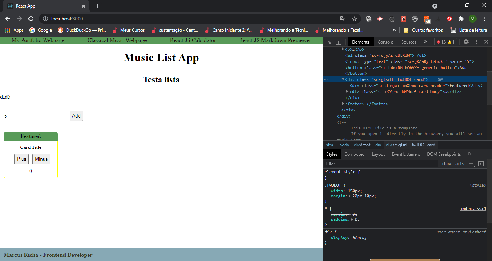

# Como gerenciar o estado das aplicações com Redux

Projeto de desenvolvimento front-end para construir uma aplicação que possui seu estado gerenciado pela biblioteca Redux JS. [^1]

Dependências:

- Styled-components
- Redux e React-redux

### Resultado Final do projeto :

[^1] Orientado pelo professor Paulo Rezende(Software engineer) da Digital Innovation One. Trilha de Frontend.

