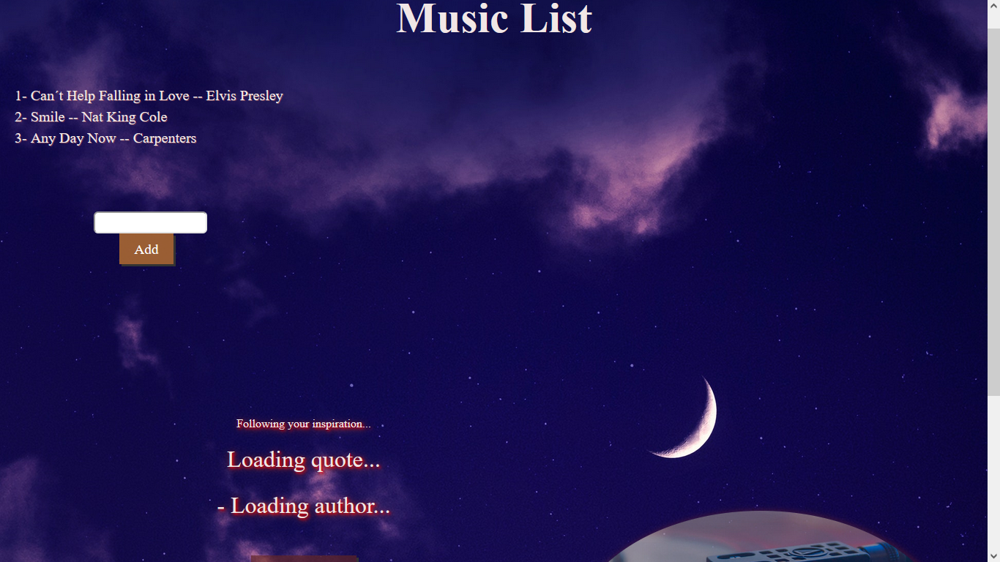
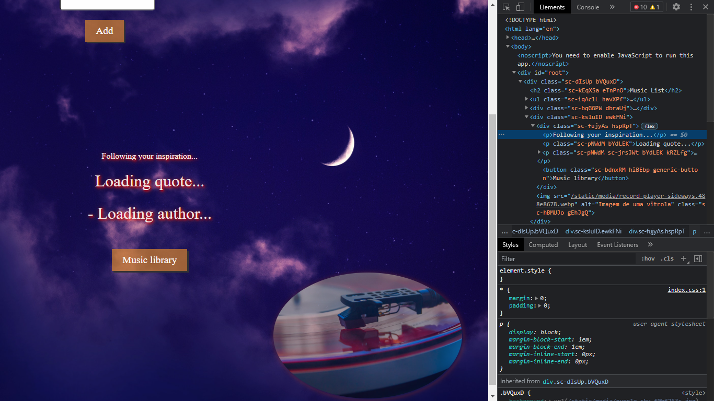

# Criando um front-end totalmente componentizado na prática com ReactJS

Projeto de desenvolvimento front-end com React-JS para construir uma aplicação de lista de música que trabalha de maneira componentizada para realizar as diversas tarefas implementadas pela Lista. [^1]

Dependências:

- Styled-components

### Resultado Final do projeto :

### Resultado Final do projeto :

### Resultado Final do projeto :

[^1] Orientado pelos projetos dos professores Celso Henrique, Nathally Souza e Paulo Rezende da Digital Innovation One. Trilha de Frontend.

